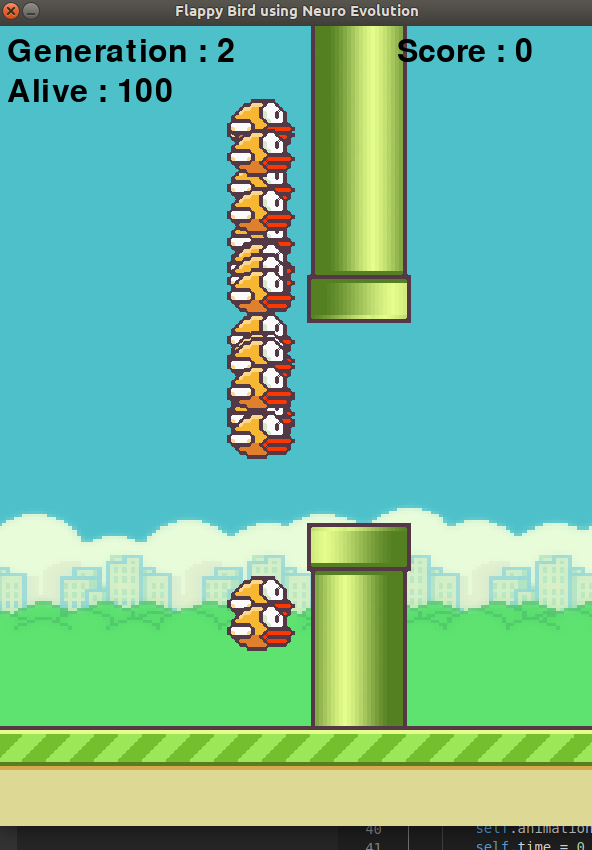

# Flappy Bird Game using genetic algorithm (NEAT)

Flappy bird is a popular game in which the user tries to stay alive by hopping between the close gap of two pipes. 
Here, I have studied about genetic algorithm in neural network and blended the concept of neuro evolution with Flappy Bird game. 

Data which is fed as input to the neural network is the HEIGHT of bird from ground and DISTANCE of bird from the two pipes (d1 & d2).
This data provided to the neural network predicts whether the bird should jump or not.

# Modules used :

  1.  Pygame for making game.
  2.  NEAT-python for genetic algorithm.

# Screenshots :

 

    As you can see below we initially start with a generation of 100 birds.

 

  

    When the bird is completely trained, it never fails and score keeps on increasing.

 

 

# Resources and links :

    1. Youtube video 1 : https://www.youtube.com/playlist?list=PLRqwX-V7Uu6Yd3975YwxrR0x40XGJ_KGO

    2. Youtube video 2 : https://www.youtube.com/watch?v=9zfeTw-uFCw&list=PLRqwX-V7Uu6bJM3VgzjNV5YxVxUwzALHV

    3. Youtube video 3 : https://www.youtube.com/watch?v=1xkykD5Olok
    
    4. Article  1 : https://towardsdatascience.com/neat-an-awesome-approach-to-neuroevolution-3eca5cc7930f
    
    5. Must read documents are available inside docs folder.
